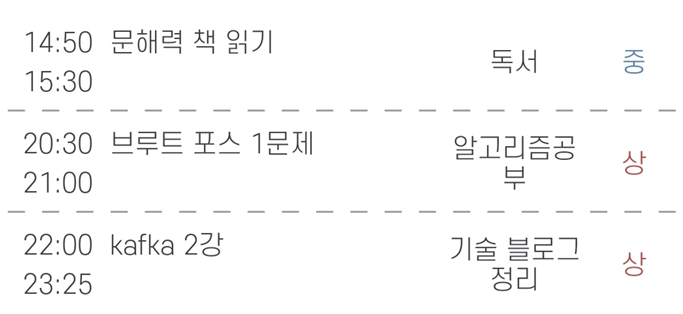

# 주간 목표 08/15 ~ 21

| 목표 | 달성률 | 
|---|---|
| 1. dev 기술블로그 보기  | /7 |
| 2. 기술블로그 작성 or 알고리즘 문제  | /7 |

---
|To do| 월| 화 |수 |목 |금 | 토| 일
|---|---|---|---|---|---|---|---|
|1. dev 기술블로그 보기 |:boom: | :boom:|:boom:| :white_check_mark: |
|2. 기술블로그 작성 or 알고리즘 문제  | :white_check_mark:  |:white_check_mark:  | :white_check_mark:
|+ 순공시간(상 기준) | 0.5  | 1 | 2  |  |

## 월

한줄 평: 데이트 및 오는길에 1문제 품 

Feedback: 거의 놀았음. 버스에서 한 문제 풀이 함

## 화

한줄 평: 알고리즘 조언 얻은날!

Feedback: 매일 한문제씩 꾸준히 풀자!
 
## 수

한줄 평: 문제 하나 품 , 모각코 첫날 약간의 잡담과 도움을 줌!

Feedback: dfs 진짜 모르네 다시 정리하자!

## 목

한줄 평: XSS 로컬 적용 성공한 날! 마무리되면 블로그 올리자!  

Feedback: 알고리즘 1문제 답보며 배움  
0. 30분 이후에도 설계 안떠오르면 답보는게 빠르고 좋은거 같다 그렇게 해서 하루에 2문제씩으로 늘려보자.
1. 0 인지 구할때 Math.abs(a-b) 
2. 최솟값구할때 Min =Math.min(val,Min)
3. 재귀가 복잡할땐 함수로 별도로 빼서 풀기 (스타트와링크 참고: https://st-lab.tistory.com/122 )

## 금

한줄 평:  

Feedback:

## 토

한줄 평: kafka 2강 실습!

Feedback: 알고리즘 풀이 전략 보완
