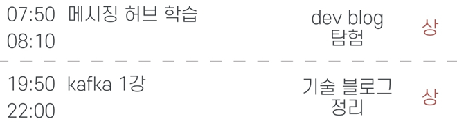

# 주간 목표 08/08 ~ 14

| 목표 | 달성률 | 
|---|---|
| 1. dev 기술블로그 보기  | /7 |
| 2. 기술블로그 작성 or 알고리즘 문제  | /7 |

---
|To do| 월| 화 |수 |목 |금 | 토| 일
|---|---|---|---|---|---|---|---|
|1. dev 기술블로그 보기 |:boom: |
|2. 기술블로그 작성 or 알고리즘 문제  | :white_check_mark:  |
|+ 순공시간(상 기준)             |   |  |   |  |

## 월

한줄 평: 데이트 및 오는길에 1문제 품 

Feedback: 거의 놀았음. 버스에서 한 문제 풀이 함

## 화

한줄 평: 

Feedback: 
 
## 수

한줄 평: kafka 1강 강의 시청 및 필사 : https://velog.io/@openthem00n/kafka1

Feedback: 강의들으니 많은 내용을 빠르게 습득 할수 있어서 좋다. 빠르게 습득하고, 프로젝트에 적용시켜보자!

## 목

한줄 평: 

Feedback: 

## 금

한줄 평:  회사업무하면서 배운게 있었음 , 저녁약속

Feedback: 주말에 달리자!

## 토

한줄 평: kafka 2강 실습!

Feedback: 알고리즘 풀이 전략 보완
