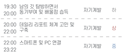
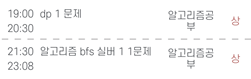
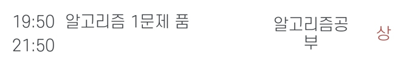
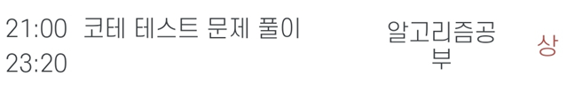

# 주간 목표 08/01 ~ 07

## 08/01~04
| 목표 | 달성률 | 
|---|---|
| 1. 알고리즘 핵심 3개 개념별 2문제씩 풀기 | 3/4 |
| 2. 하루 순 공부시간 2시간 이상 집중하기  | 4/4 |

## 08/05 ~07 
- 휴가

---
|To do| 월| 화 |수 |목 |금 | 토| 일
|---|---|---|---|---|---|---|---|
|1. 알고리즘 핵심 3개 개념별 2문제씩 풀기 |:boom: |:white_check_mark: |:white_check_mark: | :white_check_mark: |휴가|휴가|휴가
|2. 하루 순 공부시간 2시간 이상 집중하기 |:white_check_mark:|:white_check_mark: |:white_check_mark: | :white_check_mark: |휴가|휴가|휴가
|+ 순공시간(상 기준)| 2 | 3 | 2 | 2 |

## 08/01

한줄 평: 목표 세우기 및 데일리 리포트 양식 작성 한 날~ 후회는 없어~

Feedback: 낼은 bfs 연습하자. 화이팅!

## 08/02

한줄 평: dp 1 문제, bfs 1문제 품! Perfect!

Feedback: 쉬는것도 10분 쉴때 운동 함. 건강한 휴식 조아아

## 08/03

한줄 평: 브루트포스 1문제 어렵다.. 뇌가 너덜너덜해졋다

Feedback: 구현문제도 많이 풀어봐야겠다. 노하우가 부족한지 너무 오래걸린다. 

## 08/04

한줄 평: 구현 문제인데 자료구조를 많이 알아야겠다는 생각이 든다.

Feedback: 자료구조도 다양하게 다뤄보고, 구현도 많이 풀어야겠다.. 부족함을 많이 느낀다. 또한, 평소 쓰고 있는 툴을 진짜로 구현하면 어떻게 될지도 평시에 알고있어야겠다고 느꼈다.

